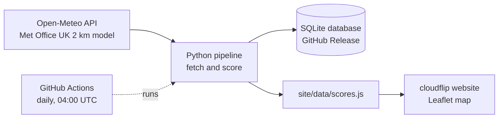

# cloudflip

**Will you stand above a sea of cloud at sunrise?** cloudflip forecasts the chance of a cloud inversion at each of Scotland's 282 Munros, for every morning of the coming week.

**Live site: [yourcloudflip.netlify.app](https://yourcloudflip.netlify.app)**

[](https://github.com/clbutler/cloud_inv/actions/workflows/nightly.yml)

[](https://yourcloudflip.netlify.app)

## What is a cloud inversion?

Normally the air gets colder with height. In a temperature inversion, a layer of warmer air sits above colder air. That warm "lid" traps cold, damp air in the glens, so cloud and fog fill the valleys while the summits stay clear. From the top of a Munro, the result is a sea of cloud below, often lit by the rising sun.

Scotland's 282 Munros, the mountains over 3,000 ft, are among the best places in the UK to see one. Inversions are hard to predict, though, and mountain forecasts are usually given per area, not per hill. cloudflip gives a verdict for every Munro, for every morning of the next seven days.

## How it works



1. **Fetch.** `scripts/openmeteo_function.py` asks [Open-Meteo](https://open-meteo.com) for 7 days of hourly Met Office forecasts at every Munro. It gets surface weather, plus temperature, humidity, cloud and wind at six pressure levels from about 100 m to 1,500 m. The pressure levels are what make an inversion visible: a warmer layer above a colder one.
2. **Score.** `scripts/inversion_score_function.py` checks every hour from one hour before sunrise to three hours after, and keeps the best hour for each Munro and day.
3. **Store.** Every run is saved to a SQLite database (see [Data](#data)).
4. **Publish.** `scripts/site_export_function.py` writes the latest scores for the website, a static page in `site/` that uses Leaflet.
5. **Automate.** A [GitHub Actions workflow](.github/workflows/nightly.yml) runs the whole pipeline every day at 04:00 UTC and commits the new website data. Netlify redeploys the site from `main` whenever that commit lands.

## How the forecast is scored

Each Munro is graded on four checks. Each check scores pass, partial or fail.

| Check | Question | Pass | Partial |
|---|---|---|---|
| **Warm lid** | Is there a layer below the summit where the air gets *warmer* with height? | temperature rises with height | cools slower than 3 °C/km |
| **Cloud below** | Is there enough moisture in the glens to form cloud or fog? | cloud ≥ 50 % or humidity ≥ 95 % | humidity ≥ 87 % |
| **Clear summit** | Will the summit itself be out of the cloud? | humidity < 84 % and little cloud above | humidity < 87 % |
| **Still air** | Is it calm enough below the summit for the cloud to settle? | wind ≤ 11 km/h | wind ≤ 20 km/h |

- **Likely**: all four checks pass.
- **Possible**: all four at least partly pass.
- **Unlikely**: anything else.

The thresholds come from the Mountain Weather Information Service (MWIS) articles on inversions, humidity thresholds for cloud from Wang & Rossow (1995, *J. Appl. Meteor.*), and radiation-fog rules from the fog-forecasting literature. Forecast models often misjudge the height of an inversion and local detail, so the score is a guide, not a guarantee.

## Data

The SQLite database (`forecasts.db`) isn't stored in the repo's files. It's attached to a GitHub Release named `data`: see **Releases** in the repo sidebar, or go straight to [the release page](https://github.com/clbutler/cloud_inv/releases/tag/data). The repo's `data/` folder is separate and only holds the Munro list.

The nightly job downloads the database, adds that night's run and uploads it again. Before each upload, the version it downloaded is saved as `forecasts-prev.db`, a backup in case the upload fails.

| Table | Contents | Kept |
|---|---|---|
| `forecasts` | hourly model output, one row per run, Munro and hour | 7 days |
| `scores` | each run's verdict, the four check grades and the values behind them | forever |
| `sunrise` | sunrise time per run, Munro and day | forever |
| `munros` | name, height, location and model ground height | replaced each run |

The score history is kept so forecasts can later be checked against inversions people actually saw. To download the latest copy:

```bash
gh release download data --pattern forecasts.db --dir outputs
```

## Running it locally

Requires Python 3.12.

```bash
python3.12 -m venv .venv
source .venv/bin/activate
pip install -r requirements.txt

cd scripts            # the scripts use paths relative to this folder
python main_munro.py  # about a minute; writes outputs/forecasts.db and site/data/scores.js
```

Then open `site/index.html` in a browser. No server or build step is needed.

## Project status

The original requirements (MoSCoW), and where they stand:

| Priority | Requirement | Status |
|---|---|---|
| Must | Inversion likelihood for any individual Munro | ✅ Done: click any Munro on the map or in the list |
| Must | Usable without running Python | ✅ Done: [hosted on Netlify](https://yourcloudflip.netlify.app), updated nightly |
| Must | Show when the data was fetched | ✅ Done: in the site footer |
| Should | Map of all Munros | ✅ Done |
| Should | Compare Munros | ✅ Done: "best bets" ranks every Munro for the chosen day |
| Should | Red/Amber/Green rating | ✅ Done, as Likely/Possible/Unlikely in sunrise colours, which are easier to read than red/green for colour-blind users |
| Could | Choose future dates | ✅ Done: 7-day strip |
| Could | Breakdown of the rating | ✅ Done: the four checks, with their values |
| Won't | Locations other than Munros | Out of scope |

## Credits and licences

Developed by Dr Chris Butler (project started January 2025).

- Forecast data: [Open-Meteo](https://open-meteo.com) (CC BY 4.0), using Met Office UKMO models. Open-Meteo's free tier is for non-commercial use.
- Munro list and locations: [The Database of British and Irish Hills](https://www.hills-database.co.uk/downloads.html) v8.0.1.
- Map: [Leaflet](https://leafletjs.com), with tiles © Esri.
- Scoring research: MWIS, Wang & Rossow (1995), and published radiation-fog forecasting rules.

**Safety:** cloudflip is an experimental forecast of scenery, not a safety tool. Before heading onto the hills, always check the [Mountain Weather Information Service](https://www.mwis.org.uk/forecasts/scottish), the [Met Office mountain forecast](https://www.metoffice.gov.uk/weather/specialist-forecasts/mountain) and, in winter, the [Scottish Avalanche Information Service](https://www.sais.gov.uk).
