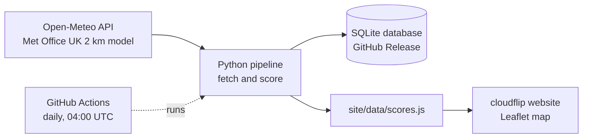
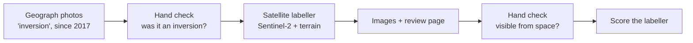

# cloudflip

**Will you stand above a sea of cloud at sunrise?** cloudflip forecasts the chance of a cloud inversion at each of Scotland's 282 Munros, for every morning of the coming week.

**Live site: [yourcloudflip.netlify.app](https://yourcloudflip.netlify.app)**

[](https://github.com/clbutler/cloud_inv/actions/workflows/nightly.yml)

[](https://yourcloudflip.netlify.app)

## What is a cloud inversion?

Normally the air gets colder with height. In a temperature inversion, a layer of warmer air sits above colder air. That warm "lid" traps cold, damp air in the glens, so cloud and fog fill the valleys while the summits stay clear. From the top of a Munro, the result is a sea of cloud below, often lit by the rising sun.

Scotland's 282 Munros, the mountains over 3,000 ft, are among the best places in the UK to see one. Inversions are hard to predict, though, and mountain forecasts are usually given per area, not per hill. cloudflip gives a verdict for every Munro, for every morning of the next seven days.

## How it works



1. **Fetch.** `scripts/openmeteo_function.py` asks [Open-Meteo](https://open-meteo.com) for 7 days of hourly Met Office forecasts at every Munro. It gets surface weather, plus temperature, humidity, cloud and wind at six pressure levels from about 100 m to 1,500 m. The pressure levels are what make an inversion visible: a warmer layer above a colder one.
2. **Score.** `scripts/inversion_score_function.py` checks every hour from one hour before sunrise to three hours after, and keeps the best hour for each Munro and day.
3. **Store.** Every run is saved to a SQLite database (see [Data](#data)).
4. **Publish.** `scripts/site_export_function.py` writes the latest scores for the website, a static page in `site/` that uses Leaflet.
5. **Automate.** A [GitHub Actions workflow](.github/workflows/nightly.yml) runs the whole pipeline every day at 04:00 UTC and commits the new website data. Netlify redeploys the site from `main` whenever that commit lands.

## How the forecast is scored

Each Munro is graded on four checks. Each check scores pass, partial or fail.

| Check | Question | Pass | Partial |
|---|---|---|---|
| **Warm lid** | Is there a layer below the summit where the air gets *warmer* with height? | temperature rises with height | cools slower than 3 °C/km |
| **Cloud below** | Is there enough moisture in the glens to form cloud or fog? | cloud ≥ 50 % or humidity ≥ 95 % | humidity ≥ 87 % |
| **Clear summit** | Will the summit itself be out of the cloud? | humidity < 84 % and little cloud above | humidity < 87 % |
| **Still air** | Is it calm enough below the summit for the cloud to settle? | wind ≤ 11 km/h | wind ≤ 20 km/h |

- **Likely**: all four checks pass.
- **Possible**: all four at least partly pass.
- **Unlikely**: anything else.

The thresholds come from the Mountain Weather Information Service (MWIS) articles on inversions, humidity thresholds for cloud from Wang & Rossow (1995, *J. Appl. Meteor.*), and radiation-fog rules from the fog-forecasting literature. Forecast models often misjudge the height of an inversion and local detail, so the score is a guide, not a guarantee.

## Data

The SQLite database (`forecasts.db`) isn't stored in the repo's files. It's attached to a GitHub Release named `data`: see **Releases** in the repo sidebar, or go straight to [the release page](https://github.com/clbutler/cloud_inv/releases/tag/data). The repo's `data/` folder is separate and only holds the Munro list.

The nightly job downloads the database, adds that night's run and uploads it again. Before each upload, the version it downloaded is saved as `forecasts-prev.db`, a backup in case the upload fails.

| Table | Contents | Kept |
|---|---|---|
| `forecasts` | hourly model output, one row per run, Munro and hour | 7 days |
| `scores` | each run's verdict, the four check grades and the values behind them | forever |
| `sunrise` | sunrise time per run, Munro and day | forever |
| `munros` | name, height, location and model ground height | replaced each run |

The score history is kept so forecasts can later be checked against inversions people actually saw. To download the latest copy:

```bash
gh release download data --pattern forecasts.db --dir outputs
```

## Checking against satellite images

Work in progress. The aim is to check the forecast against what actually happened and, later, to collect labelled images for training a model.

From above, an inversion looks like a sea of cloud filling the low ground, with the hilltops clear. [Sentinel-2](https://sentinel.esa.int/web/sentinel/missions/sentinel-2) photographs Britain every 2 to 5 days at 10 m resolution, so a script can look for that pattern.



1. **Sightings.** `main_sightings.py` searches [Geograph](https://www.geograph.org.uk) for photos taken in Britain since 2017 that mention an inversion or a sea of cloud. It needs no API key. Each photo was checked by hand; 226 of 326 showed an inversion.
2. **Labeller.** `satellite_function.py` reads Sentinel-2's scene classification (cloud, shadow, land, water and so on) in an 8 km box around each Munro or photo spot, at 40 m. It overlays the [Copernicus 30 m terrain model](https://planetarycomputer.microsoft.com/dataset/cop-dem-glo-30). Both come free from [Microsoft Planetary Computer](https://planetarycomputer.microsoft.com), and only the small box is downloaded. The labeller then compares two areas:
   - **the top**: ground within 100 m of the summit height and within 1 km of it;
   - **the low ground**: more than 300 m below the summit, or halfway down to the valley floor on hills too small for that.

   It labels the pass **inversion** (10 % or less cloud on the top, at least 10 % on the low ground, and the low ground at least 20 points whiter than the ground above it), **snow** (no verdict), **summit in cloud**, **clear**, **mixed** or **no data**. Away from the Munros, the "summit" is the highest ground within 1 km of where the photo was taken.
3. **Images and review.** `main_satellite_sightings.py` runs the labeller on each checked sighting. `main_satellite_images.py` draws the true-colour image of each pass, and `main_review_page.py` builds a local page for marking whether an inversion is visible in each one.
4. **Forecast check.** `main_satellite.py` labels every Munro on each day with saved scores and compares the labels with the forecast made before the pass.
5. **Random days.** `main_satellite_scan.py` samples days across every month since 2017, and `main_backcast.py` scores past days with archived forecasts. `main_review_batch.py` turns either into a review page. The page shows neither the labeller's nor the site's verdict, and reveals a ground photo, where one exists, only after the satellite view has been answered.

**Can you tell an inversion from a satellite view?** The labels below come from a person looking at each Sentinel-2 view. So first, a check of that person against the ground. Where a [Geograph](https://www.geograph.org.uk) photo was taken near the same hill on the same day, the photo was judged separately from the satellite view, and the satellite view was answered first so the photo couldn't sway it.

| | satellite view: inversion | satellite view: none | total |
|---|---|---|---|
| photo: inversion | 21 | 14 | 35 |
| photo: none | 3 | 30 | 33 |

Over 68 views on 48 days:

| | photo agrees | 95 % range |
|---|---|---|
| satellite view says inversion | 21 of 24 (88 %) | 69–96 % |
| satellite view says none, when the photo shows none | 30 of 33 (91 %) | 76–97 % |
| photo shows an inversion and the satellite view sees it | 21 of 35 (60 %) | 44–74 % |

Overall agreement is 75 % (Cohen's kappa 0.50, where 0 is chance and 1 is perfect). Almost every disagreement is a photo of an inversion with no inversion in the satellite view. Geograph records the day a photo was taken but not the time, and Sentinel-2 passes at about 11:30 UTC, so most of these are probably inversions that had cleared by the pass. That can't be proved from the data, so the honest reading is: a "yes" from the satellite view is reliable, but the satellite view misses inversions that don't last until late morning.

The automatic labeller can also be checked against the photos directly, with no person in between (72 views):

| | photo agrees | 95 % range |
|---|---|---|
| labeller says inversion | 14 of 15 (93 %) | 70–99 % |
| labeller says none, when the photo shows none | 31 of 32 (97 %) | 84–99 % |
| photo shows an inversion and the labeller sees it | 14 of 40 (35 %) | 22–50 % |

So the labeller is cautious: when it calls an inversion the ground almost always agrees, but it calls far fewer than the photographers saw.

**How good is the automatic labeller?** Against those satellite-view answers, on 557 views over 263 days:

| | labeller: inversion | labeller: other | total |
|---|---|---|---|
| checked: inversion | 40 | 20 | 60 |
| checked: none | 30 | 467 | 497 |

When it says "inversion" it is right 57 % of the time (40/70), and it finds 67 % of the inversions (40/60). The thresholds were set on days outside the held-out months. On the held-out days alone it is right 58 % of the time (19/33) and finds 76 % (19/25), so the rules aren't just fitted to the data they were tuned on.

An earlier version looked much better: 19 right out of 20 "inversion" calls. That test used only days when someone had photographed an inversion, mostly on low hills in England. On random Munro days its "inversions" were mostly snow, which Sentinel-2's own classes call "not cloud", and scattered cumulus that happened to miss the summit. Two rules fixed most of that:
- **Snow**: a view with snow in it gets no verdict.
- **Contours**: a cloud sea follows the contours, so the low ground must be clearly whiter than the ground above it. Cumulus whitens both alike.

**How good is the forecast?** For 40 Munros spread across Scotland, the site's scoring was run on [archived Met Office forecasts](https://open-meteo.com/en/docs/historical-forecast-api) from August 2024 (`main_backcast.py`). Each morning was set against the satellite view of the same day (`main_review_batch.py batch2`). Every Likely and Possible day was checked, plus a random sample of Unlikely days and some Unlikely days the labeller had flagged.

| site's verdict | checked: inversion | checked: none | total |
|---|---|---|---|
| Likely | 2 | 17 | 19 |
| Possible | 12 | 198 | 210 |
| Unlikely (random sample) | 1 | 104 | 105 |
| Unlikely (flagged by the labeller) | 17 | 80 | 97 |

The same comparison at scale uses the labeller instead of a person, on every scored day with a usable satellite view: 7,814 Munro-days on 445 days, snowy views left out.

| site's verdict | labeller saw an inversion | held-out months | other months |
|---|---|---|---|
| Likely | 3 of 19 (16 %) | 1 of 8 (13 %) | 2 of 11 (18 %) |
| Possible | 15 of 210 (7.1 %) | 5 of 59 (8.5 %) | 10 of 151 (6.6 %) |
| Unlikely | 101 of 7,585 (1.3 %) | 40 of 2,696 (1.5 %) | 61 of 4,889 (1.2 %) |

A Likely morning is about 12 times as likely as an Unlikely one to still show an inversion at 11:30, and a Possible one about 5 times, and that holds in the held-out months. But the site rated only 18 of the 119 inversions the labeller saw as Likely or Possible, so it misses most of them.

In the hand-checked table, Possible days show an inversion at 11:30 more often than random Unlikely days (6 % against 1 %), but few of the site's Likely or Possible mornings still have one by the time the satellite passes. Where the satellite saw the summit in cloud on a Possible day, there was never an inversion. Either the clear top check is too lenient, or the cloud lifted after dawn. A dawn forecast checked against a late-morning picture can't tell those apart, so this table is a lower bound on how well the forecast does at sunrise.

All these tables are rebuilt from the hand checks and the backcast by `python main_validation.py`.

**Limits.**
- Sentinel-2 passes at about 11:30 UTC, so neither the labeller nor the hand checks see inversions that clear earlier. Of 93 photo-confirmed inversion days, 53 had no pass over that spot at all.
- The 60 inversions checked by hand come from 32 separate days, and many from a few settled spells, so the percentages are still rough.
- Ground photos are rare on random days: the nearest Geograph photo of an ordinary day is usually 15 to 100 km from the Munro.

| File | What it holds |
|---|---|
| `data/inversion_sightings.csv` | Geograph sightings: date, place, nearest Munro, link, and the hand checks `checked` and `inversion` (Y/N) |
| `data/satellite_batch1_checks.csv`, `data/satellite_batch2_checks.csv` | hand checks of random Munro days (batch 1) and of past days the site scored (batch 2): `visible`, and `photo_shows` where a ground photo was revealed |
| `data/satellite_image_checks.csv` | one row per satellite pass over a sighting: the labeller's verdict and the hand check `visible` (is an inversion visible in the image: Y, N, maybe or unclear) |
| `outputs/satellite_vs_sightings.csv`, `outputs/satellite_images/` | the labeller's results, images and review page (not in git, rebuilt by the scripts) |
| `outputs/satellite.db`, `outputs/satellite_vs_scores.csv` | Munro labels for the days with saved scores, and the comparison with the forecast (not in git) |

```bash
cd scripts
python main_sightings.py            # update the sightings csv; keeps the hand checks
python main_satellite_sightings.py  # run the labeller on the checked sightings, about 2 minutes
python main_satellite_images.py     # true-colour image of each pass (--classes adds the cloud classes)
python main_review_page.py          # then open ../outputs/satellite_images/review.html
python main_satellite.py            # label the Munros and compare with the forecast (needs forecasts.db)
python main_backcast.py forecast    # score past days from archived forecasts, about 2 hours (free API limits)
python main_backcast.py satellite   # label the satellite passes for the same Munros and days
python main_review_batch.py batch2  # then open ../outputs/satellite_batch2/review.html
python main_validation.py           # the evidence tables above
```

## Running it locally

Requires Python 3.12.

```bash
python3.12 -m venv .venv
source .venv/bin/activate
pip install -r requirements.txt

cd scripts            # the scripts use paths relative to this folder
python main_munro.py  # about a minute; writes outputs/forecasts.db and site/data/scores.js
```

Then open `site/index.html` in a browser. No server or build step is needed.

## Project status

The original requirements (MoSCoW), and where they stand:

| Priority | Requirement | Status |
|---|---|---|
| Must | Inversion likelihood for any individual Munro | ✅ Done: click any Munro on the map or in the list |
| Must | Usable without running Python | ✅ Done: [hosted on Netlify](https://yourcloudflip.netlify.app), updated nightly |
| Must | Show when the data was fetched | ✅ Done: in the site footer |
| Should | Map of all Munros | ✅ Done |
| Should | Compare Munros | ✅ Done: "best bets" ranks every Munro for the chosen day |
| Should | Red/Amber/Green rating | ✅ Done, as Likely/Possible/Unlikely in sunrise colours, which are easier to read than red/green for colour-blind users |
| Could | Choose future dates | ✅ Done: 7-day strip |
| Could | Breakdown of the rating | ✅ Done: the four checks, with their values |
| Won't | Locations other than Munros | Out of scope |

## Credits and licences

Developed by Dr Chris Butler (project started January 2025).

- Forecast data: [Open-Meteo](https://open-meteo.com) (CC BY 4.0), using Met Office UKMO models. Open-Meteo's free tier is for non-commercial use.
- Munro list and locations: [The Database of British and Irish Hills](https://www.hills-database.co.uk/downloads.html) v8.0.1.
- Map: [Leaflet](https://leafletjs.com), with tiles © Esri.
- Scoring research: MWIS, Wang & Rossow (1995), and published radiation-fog forecasting rules.
- Satellite images: Copernicus Sentinel-2 data and the Copernicus DEM GLO-30 (© DLR e.V. 2010–2014 and © Airbus Defence and Space GmbH 2014–2018, provided under COPERNICUS by the European Union and ESA), accessed through Microsoft Planetary Computer.
- Sightings: photos on [Geograph Britain and Ireland](https://www.geograph.org.uk), © their photographers, licensed CC BY-SA 2.0. The repo stores only the date, place, title, photographer and link, not the photos.

**Safety:** cloudflip is an experimental forecast of scenery, not a safety tool. Before heading onto the hills, always check the [Mountain Weather Information Service](https://www.mwis.org.uk/forecasts/scottish), the [Met Office mountain forecast](https://www.metoffice.gov.uk/weather/specialist-forecasts/mountain) and, in winter, the [Scottish Avalanche Information Service](https://www.sais.gov.uk).
