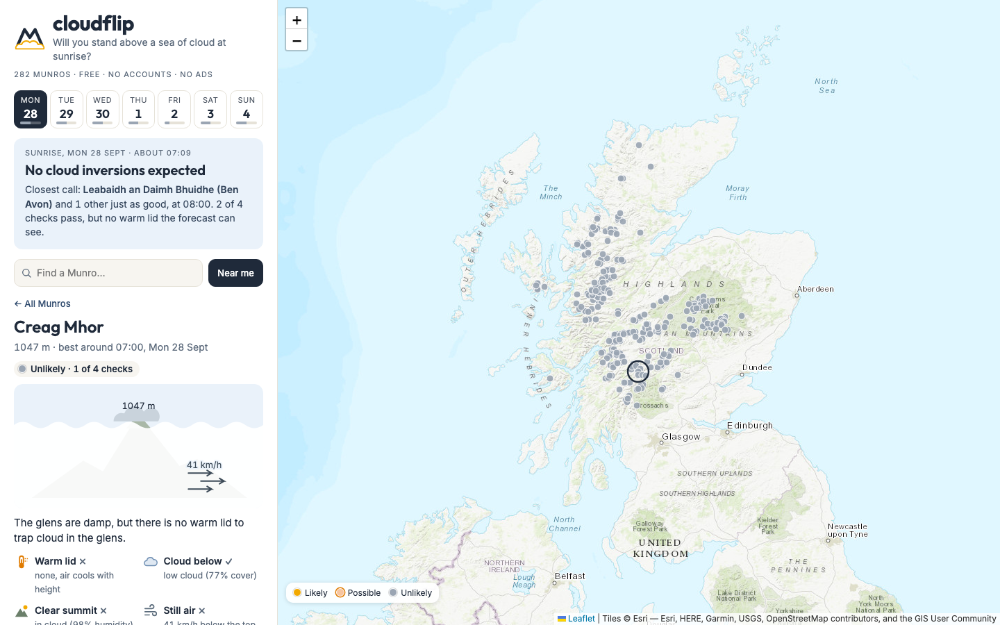
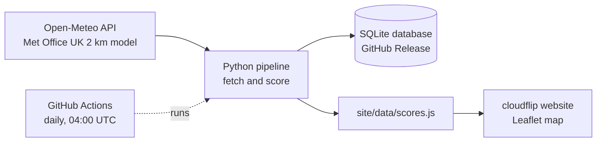
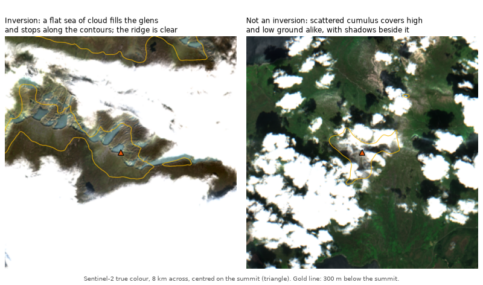

# cloudflip

**Will you stand above a sea of cloud at sunrise?** cloudflip forecasts the chance of a cloud inversion at each of Scotland's 282 Munros, for every morning of the coming week.

**Live site: [yourcloudflip.netlify.app](https://yourcloudflip.netlify.app)**

**How good is it?** Checked against satellite views of 7,814 past Munro mornings, a morning cloudflip rated Likely or Possible was about 5 times as likely as the average morning to have an inversion. But it flagged only about 1 in 7 of the inversions seen. [More below](#how-accurate-is-it).

[](https://github.com/clbutler/cloud_inv/actions/workflows/nightly.yml)

[](https://yourcloudflip.netlify.app)

## What is a cloud inversion?

Normally the air gets colder with height. In a temperature inversion, a layer of warmer air sits above colder air. That warm "lid" traps cold, damp air in the glens, so cloud and fog fill the valleys while the summits stay clear. From the top of a Munro, the result is a sea of cloud below, often lit by the rising sun.

Scotland's 282 Munros, the mountains over 3,000 ft, are among the best places in the UK to see one. Inversions are hard to predict, though, and mountain forecasts are usually given per area, not per hill. cloudflip gives a verdict for every Munro, for every morning of the next seven days.

## How it works



1. **Fetch.** `scripts/openmeteo_function.py` asks [Open-Meteo](https://open-meteo.com) for 7 days of hourly Met Office forecasts at every Munro. It gets surface weather, plus temperature, humidity, cloud and wind at six pressure levels from about 100 m to 1,500 m. The pressure levels are what make an inversion visible: a warmer layer above a colder one.
2. **Score.** `scripts/inversion_score_function.py` checks every hour from one hour before sunrise to three hours after, and keeps the best hour for each Munro and day.
3. **Store.** Every run is saved to a SQLite database (see [The forecast database](#for-developers)).
4. **Publish.** `scripts/site_export_function.py` writes the latest scores for the website, a static page in `site/` that uses Leaflet.
5. **Automate.** A [GitHub Actions workflow](.github/workflows/nightly.yml) runs the whole pipeline every day at 04:00 UTC and commits the new website data. Netlify redeploys the site from `main` whenever that commit lands.

## How the forecast is scored

Each Munro is graded on four checks. Each check scores pass, partial or fail.

| Check | Question | Pass | Partial |
|---|---|---|---|
| **Warm lid** | Is there a layer below the summit where the air gets *warmer* with height? | temperature rises with height | cools slower than 3 °C/km |
| **Cloud below** | Is there enough moisture in the glens to form cloud or fog? | cloud ≥ 50 % or humidity ≥ 95 % | humidity ≥ 87 % |
| **Clear summit** | Will the summit itself be out of the cloud? | humidity < 84 % and little cloud above | humidity < 87 % |
| **Still air** | Is it calm enough below the summit for the cloud to settle? | wind ≤ 11 km/h | wind ≤ 20 km/h |

- **Likely**: all four checks pass.
- **Possible**: all four at least partly pass.
- **Unlikely**: anything else.

The thresholds come from the Mountain Weather Information Service (MWIS) articles on inversions, humidity thresholds for cloud from Wang & Rossow (1995, *J. Appl. Meteor.*), and radiation-fog rules from the fog-forecasting literature. Forecast models often misjudge the height of an inversion and local detail, so the score is a guide, not a guarantee.

## How accurate is it?

**Headlines**, from 7,814 past mornings at 40 Munros (August 2024 to June 2026), each set against an automatic reading of a satellite view of the same morning:

- **Inversions are rare.** On the average Munro morning, only about 1 in 65 (1.5 %) still has one visible from space at 11:30 UTC.
- **Likely or Possible makes an inversion about 5 times as likely** as the average morning: about 1 in 13 (8 %). Likely on its own did better, 3 of 19 mornings (16 %), but with so few mornings the true figure could be anywhere from about 6 % to 38 %.
- **It misses most inversions.** Only about 1 in 7 (15 %) of the inversions seen had been rated Likely or Possible.
- **Treat these as rough.** The automatic reading is itself wrong about 4 times in 10 when it says "inversion", which could push the figures either way. And cloudflip forecasts sunrise while the satellite looks at about 11:30 UTC, after many inversions have cleared, which probably makes the forecast look worse than it is at dawn.

The forecast is judged by an automatic labeller reading satellite views (see [How the satellite check works](#how-the-satellite-check-works)). The forecast figures come first below, then the two checks they rest on: that an inversion can be recognised from space at all, and that the labeller recognises it.

### Does the forecast work?

The site's scoring was run on [archived Met Office forecasts](https://open-meteo.com/en/docs/historical-forecast-api) for 40 Munros spread across Scotland, from August 2024 to June 2026. Each morning's verdict was then set against the labeller's reading of that day's satellite view: 7,814 Munro-mornings from 445 days with a usable view, snowy views left out.

**The confusion matrix.** This counts every morning by what cloudflip said and what the labeller read in that morning's satellite view. "Likely" and "Possible" both count as cloudflip saying yes.

| | labeller saw an inversion | labeller saw none |
|---|---|---|
| **cloudflip said Likely or Possible** | **18** true positives | **211** false positives |
| **cloudflip said Unlikely** | **101** false negatives | **7,484** true negatives |

- **True positive**: cloudflip said yes and there was an inversion (caught).
- **False positive**: cloudflip said yes but there was none (a false alarm).
- **False negative**: cloudflip said no but there was one (missed).
- **True negative**: cloudflip said no and there was none (correctly ruled out).

Two figures come from it:

- **Precision: 7.9 %**, true positives ÷ (true positives + false positives) = 18 ÷ 229. This answers "if the site says Likely or Possible, how often is it right?" On its own 7.9 % sounds low, but only 1.5 % of all mornings had an inversion, so a flagged morning is about 5 times as likely as the average one.
- **Recall: 15 %**, true positives ÷ (true positives + false negatives) = 18 ÷ 119. This answers "of the inversions that happened, how many did the site see coming?"

Plain accuracy (the share of all mornings called correctly) is 96 %, but it isn't a useful measure here: inversions are so rare that a site saying "Unlikely" every single day would score 98.5 %. For the same reason, "Unlikely" being right 98.7 % of the time says little on its own. Precision and recall are what show whether the forecast actually finds inversions.

Broken down by verdict:

| cloudflip's verdict | inversion still visible at 11:30 UTC |
|---|---|
| Likely | **16 %** (3 of 19 mornings, so very uncertain) |
| Possible | **7 %** (1 in 14) |
| Unlikely | **1.3 %** (1 in 75) |

The held-back months (March, June, September and December) look similar: precision 9 % and recall 13 %, against 7 % and 16 % in the other months. But that rests on only 6 caught inversions, so it's a rough check rather than a confirmation.

Two things to bear in mind. The labeller that stands in for the truth is itself right only about 6 times in 10 when it says "inversion" (see below), so some of the true positives and false negatives are wrong. And cloudflip forecasts sunrise while the satellite sees 11:30 UTC, so the forecast is probably better at dawn than these figures show. Of the Possible mornings checked by eye, none where the satellite showed the summit in cloud was an inversion. Either the clear-summit check is too lenient, or the cloud lifted over the summit after dawn. A late-morning picture can't tell those apart.

### Can you tell an inversion from space?

Each satellite view was judged by eye. Where a [Geograph](https://www.geograph.org.uk) photo had been taken near the same hill on the same day, the photo was judged separately. Based on 68 pairs from 48 days:

| | |
|---|---|
| When the satellite view shows an inversion, the ground photo agrees | **88 %** |
| When the ground photo shows no inversion, the satellite view agrees | **91 %** |
| When the ground photo shows an inversion, the satellite view shows it too | **60 %** |

So an inversion seen from space is almost always real, but the satellite misses some that people photographed. Sentinel-2 passes at about 11:30 UTC, and Geograph records the day a photo was taken but not the time, so most of the misses are probably dawn inversions that had cleared by late morning.

One caution: 59 of these pairs come from an earlier review page that showed the photo verdict and the labeller's verdict beside each satellite view, so they weren't judged blind. The newer review pages hide both and reveal the photo only after the satellite view has been answered. The 9 blind pairs so far all agree, but they're all days with no inversion, so more blind pairs with an inversion are needed before this table can be called independent.

### How good is the automatic labeller?

The labeller is the program that looks at each satellite view and decides whether it shows an inversion ([how it works](#how-the-satellite-check-works)). To grade it, each view needs a "right answer", and there are two sources of one:

- **A person's verdict on the same satellite view.** 557 views from 263 days: the two review batches described below, plus 59 views of days with a Geograph inversion photo.
- **A person's verdict on a ground photo taken near the same hill that day.** 72 views. This comes from a different picture, so it's a separate check, though a dawn ground photo can show an inversion that had gone by the time the satellite passed.

Two questions matter:

| | judged from the satellite view | judged from a ground photo |
|---|---|---|
| **When it says "inversion", how often is it right?** | **57 %** | **93 %** |
| **Of the real inversions, how many does it spot?** | **67 %** | **35 %** |

In plain words: against the satellite views, about 6 in 10 of its "inversion" calls are right, and it spots about 2 in 3 of the inversions a person can see. Against the ground photos its "inversion" calls are nearly always right, but that flatters it: 40 of the 72 ground photos show an inversion, so a "yes" is likely to be right there anyway. It spots only about 1 in 3 of the inversions in the ground photos. Some of those had probably cleared before the satellite passed at about 11:30 UTC, but not all: judged by eye, the satellite view still shows 60 % of them, so the labeller misses some inversions that were there to be seen.

Some views were held back as a check: March, June, September and December for the forecast mornings, and every day from 2022 onwards for the rest. On those it was right 58 % of the time and found 76 % of inversions, about the same as on the other views. The contour threshold was chosen from a few round numbers while looking at all the views, though, so that's a consistency check rather than a clean test on unseen data.

**Limits.** The 60 inversions checked by eye come from 32 separate days, many from a few settled spells, so the percentages are still rough. Sentinel-2 passes each place only every 2 to 5 days. The labeller can't judge snowy hills, because Sentinel-2's own classes mix up snow and cloud tops.

## How the satellite check works

[Sentinel-2](https://sentinel.esa.int/web/sentinel/missions/sentinel-2) photographs Britain every 2 to 5 days, at about 11:30 UTC, at 10 m resolution. From above, an inversion has a distinctive look: a flat sea of cloud filling the glens and stopping along the contours, with the high ground clear. Ordinary cloud doesn't care about height.



The labeller (`label_box` in `scripts/satellite_function.py`) turns that idea into rules. For each Munro and each satellite pass:

1. **Read a small square.** It reads an 8 km square centred on the summit, at 40 m per pixel, from [Microsoft Planetary Computer](https://planetarycomputer.microsoft.com). That's free, needs no key, and only downloads the square, not the whole picture.
2. **Classify every pixel.** Sentinel-2 comes with ESA's scene classification, which marks each pixel as cloud, snow, cloud shadow, vegetation, bare ground, water and so on. The labeller uses that, not the colours.
3. **Add the terrain.** The [Copernicus 30 m height model](https://planetarycomputer.microsoft.com/dataset/cop-dem-glo-30) gives the height of every pixel. That splits the square into:
   - **the top**: ground within 100 m of the summit's height and within 1 km of it;
   - **the low ground**: more than 300 m below the summit (the gold line in the pictures).

   On hills too small for that, such as photo spots away from the Munros, the low ground starts halfway down to the valley floor, and the top shrinks to match.
4. **Decide.** It works down these questions and stops at the first "yes":


The numbers behind those questions:

| Rule | Threshold | Why |
|---|---|---|
| Top almost clear | 10 % cloud or less | a few wisps on the summit are allowed |
| Some cloud on the low ground | 10 % or more | a cloud sea filling only the glen floors covers little of an 8 km square |
| Low ground clearly whiter than the ground above | at least 20 percentage points more white (cloud or snow class) | a cloud sea follows the contours; cumulus covers high and low ground alike, so this rule removes most false alarms |
| Any snow | more than 1 % of the land in the square | a snowy summit is classed "not cloud", so it would pass as clear, and bright cloud is sometimes classed as snow |

**How the views were judged by eye.** `main_review_batch.py` builds a review page of satellite views. The page shows neither the labeller's verdict nor the forecast, and the cards are shuffled, so neither can sway the answer. Where a Geograph photo exists, it's revealed only after the satellite view has been answered. There are two batches so far:
- **Batch 1**: 67 views from 54 random days since 2017 (`main_satellite_scan.py`). The days were random, but the labeller picked which views to show: mostly ones it called an inversion, plus some near misses and clear or cloudy ones.
- **Batch 2**: 431 mornings the site had scored (`main_backcast.py`). These were every Likely and Possible morning, plus some Unlikely ones, chosen at random or because the labeller saw an inversion.

## Project status

The original requirements (MoSCoW), and where they stand:

| Priority | Requirement | Status |
|---|---|---|
| Must | Inversion likelihood for any individual Munro | ✅ Done: click any Munro on the map or in the list |
| Must | Usable without running Python | ✅ Done: [hosted on Netlify](https://yourcloudflip.netlify.app), updated nightly |
| Must | Show when the data was fetched | ✅ Done: in the site footer |
| Should | Map of all Munros | ✅ Done |
| Should | Compare Munros | ✅ Done: "best bets" ranks every Munro for the chosen day |
| Should | Red/Amber/Green rating | ✅ Done, as Likely/Possible/Unlikely in sunrise colours, which are easier to read than red/green for colour-blind users |
| Could | Choose future dates | ✅ Done: 7-day strip |
| Could | Breakdown of the rating | ✅ Done: the four checks, with their values |
| Won't | Locations other than Munros | Out of scope |

## For developers

### Running it locally

Requires Python 3.12.

```bash
python3.12 -m venv .venv
source .venv/bin/activate
pip install -r requirements.txt

cd scripts            # the scripts use paths relative to this folder
python main_munro.py  # about a minute; writes outputs/forecasts.db and site/data/scores.js
```

Then open `site/index.html` in a browser. No server or build step is needed.

<details>
<summary>The forecast database</summary>

The SQLite database (`forecasts.db`) isn't stored in the repo's files. It's attached to the GitHub Release [`data`](https://github.com/clbutler/cloud_inv/releases/tag/data). The nightly job downloads it, adds that night's run and uploads it again, keeping the previous copy as `forecasts-prev.db` in case the upload fails.

| Table | Contents | Kept |
|---|---|---|
| `forecasts` | hourly model output, one row per run, Munro and hour | 7 days |
| `scores` | each run's verdict, the four check grades and the values behind them | forever |
| `sunrise` | sunrise time per run, Munro and day | forever |
| `munros` | name, height, location and model ground height | replaced each run |

```bash
gh release download data --pattern forecasts.db --dir outputs --clobber
```
</details>

<details>
<summary>The satellite check scripts and data</summary>

```bash
cd scripts
python main_sightings.py            # collect Geograph photos tagged as inversions
python main_satellite_sightings.py  # run the labeller on those photos' days
python main_satellite_scan.py       # sample satellite passes over the Munros since 2017
python main_review_batch.py         # batch 1 review page: ../outputs/satellite_batch1/review.html
python main_backcast.py forecast    # score past mornings from archived forecasts (about 2 hours: free API limits)
python main_backcast.py satellite   # label the satellite passes for the same Munros and days
python main_backcast.py compare     # line the two up
python main_review_batch.py batch2  # batch 2 review page: ../outputs/satellite_batch2/review.html
python main_validation.py           # rebuild the accuracy figures above (needs all of the above)
```

| File | What it holds |
|---|---|
| `data/satellite_batch1_checks.csv`, `data/satellite_batch2_checks.csv` | satellite views judged by eye (`visible`), with the ground photo verdict (`photo_shows`) where one was revealed |
| `data/satellite_image_checks.csv` | satellite views of days with a Geograph inversion photo, judged by eye |
| `data/inversion_sightings.csv` | Geograph photos tagged as inversions, each checked by hand (`inversion`) |

Apart from the Munro shapefile (`outputs/munro.*`) and some old outputs, `outputs/` is rebuilt by the scripts and isn't kept in git.
</details>

## Credits and licences

Developed by Dr Chris Butler (project started January 2025).

- Forecast data: [Open-Meteo](https://open-meteo.com) (CC BY 4.0), using Met Office UKMO models. Open-Meteo's free tier is for non-commercial use.
- Munro list and locations: [The Database of British and Irish Hills](https://www.hills-database.co.uk/downloads.html) v8.0.1.
- Map: [Leaflet](https://leafletjs.com), with tiles © Esri.
- Scoring research: MWIS, Wang & Rossow (1995), and published radiation-fog forecasting rules.
- Satellite images: Copernicus Sentinel-2 data and the Copernicus DEM GLO-30 (© DLR e.V. 2010–2014 and © Airbus Defence and Space GmbH 2014–2018, provided under COPERNICUS by the European Union and ESA), accessed through Microsoft Planetary Computer.
- Sightings: photos on [Geograph Britain and Ireland](https://www.geograph.org.uk), © their photographers, licensed CC BY-SA 2.0. The repo stores only the date, place, title, photographer and link, not the photos.

**Safety:** cloudflip is an experimental forecast of scenery, not a safety tool. Before heading onto the hills, always check the [Mountain Weather Information Service](https://www.mwis.org.uk/forecasts/scottish), the [Met Office mountain forecast](https://www.metoffice.gov.uk/weather/specialist-forecasts/mountain) and, in winter, the [Scottish Avalanche Information Service](https://www.sais.gov.uk).
