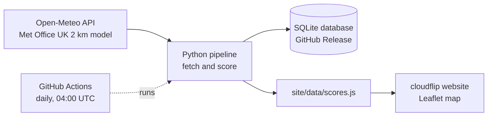
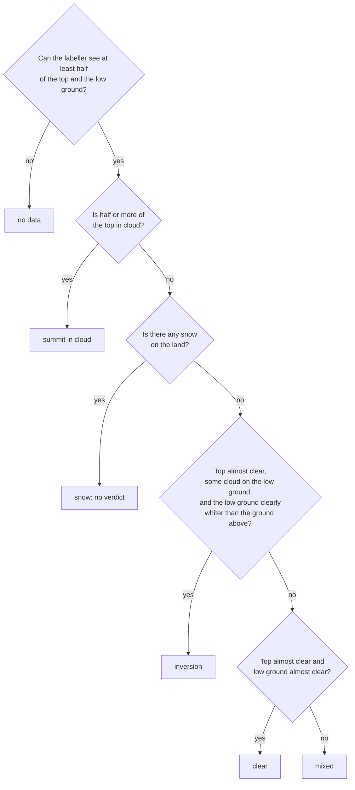

# cloudflip

**Will you stand above a sea of cloud at sunrise?** cloudflip forecasts the chance of a cloud inversion at each of Scotland's 282 Munros, for every morning of the coming week.

**Live site: [yourcloudflip.netlify.app](https://yourcloudflip.netlify.app)**

**How good is cloudflip?** Tested against satellite views of 7,814 past mornings at 40 Munros: when cloudflip says Likely or Possible, an inversion is about 5 times as likely as usual. But cloudflip catches only about 1 in 7 inversions. [Details](#how-accurate-is-cloudflip).

[](https://github.com/clbutler/cloud_inv/actions/workflows/nightly.yml)

[](https://yourcloudflip.netlify.app)

## What is a cloud inversion?

Normally air gets colder with height. In an inversion, a layer of warm air sits on top of cold air like a lid, trapping cloud and fog in the glens while the summits stay clear. From the top you look down on a sea of cloud, often lit by the rising sun.

Scotland's 282 Munros (hills over 3,000 ft) are among the best places in the UK to see one. But inversions are hard to predict, and mountain forecasts cover areas, not single hills. cloudflip gives a verdict for every Munro, every morning, a week ahead.

## How accurate is cloudflip?

Each morning, each Munro gets **Likely**, **Possible** or **Unlikely**, from [four checks](#how-the-forecast-is-scored) on the forecast. To test them, the scoring was rerun on [archived Met Office forecasts](https://open-meteo.com/en/docs/historical-forecast-api) for 40 Munros, August 2024 to June 2026, and each morning was compared with a satellite view of the same day.

**Headlines** (7,814 mornings, 445 days):

- **Inversions are rare:** about 1 morning in 65 (1.5 %) still has one visible at 11:30 UTC.
- **Likely or Possible makes one about 5 times as likely:** 1 in 13 (8 %). Likely alone scored 3 of 19 (16 %), too few to be sure.
- **cloudflip misses most inversions:** the site flagged only about 1 in 7 (15 %).
- **Treat these as rough.** The satellite views are read by an [automatic labeller](#how-the-satellite-check-works) whose "inversion" calls are wrong about 4 times in 10. And the satellite passes at about 11:30 UTC, after many dawn inversions have gone, so the forecast is probably better at sunrise than these figures show.

### Does the forecast work?

**Confusion matrix.** Likely or Possible counts as a "yes"; snowy views are left out.

| | **Actual positive**<br/>labeller saw an inversion | **Actual negative**<br/>labeller saw none |
|---|---|---|
| **Predicted positive**<br/>cloudflip said Likely or Possible | **True positive**<br/>18 caught | **False positive**<br/>211 false alarms |
| **Predicted negative**<br/>cloudflip said Unlikely | **False negative**<br/>101 missed | **True negative**<br/>7,484 correctly ruled out |

- **Precision = TP ÷ (TP + FP) = 18 ÷ 229 = 7.9 %.** When the site says yes, how often is there an inversion? Low at first sight, but 5 times the 1.5 % base rate.
- **Recall = TP ÷ (TP + FN) = 18 ÷ 119 = 15 %.** Of the inversions that happened, how many did the site flag?

Plain accuracy (96 %) is misleading here: inversions are so rare that saying "Unlikely" every day would score 98.5 %.

| Verdict | Inversion seen at 11:30 UTC |
|---|---|
| Likely | **16 %** (3 of 19, very uncertain) |
| Possible | **7 %** (1 in 14) |
| Unlikely | **1.3 %** (1 in 75) |

Held-back months (March, June, September, December) look similar, with precision 9 % and recall 13 %, but that rests on just 6 inversions.

One pattern stands out: on the Possible mornings checked by eye where the satellite showed the summit in cloud, there was never an inversion. Either the [clear-summit check](#how-the-forecast-is-scored) is too lenient, or the cloud rose after dawn.

### Can you tell an inversion from space?

Where a [Geograph](https://www.geograph.org.uk) ground photo was taken near the same hill on the same day, the photo and the satellite view were judged separately (68 pairs, 48 days):

| | |
|---|---|
| Satellite view shows an inversion: the photo agrees | **88 %** |
| Photo shows none: the satellite view agrees | **91 %** |
| Photo shows one: the satellite view shows the inversion too | **60 %** |

An inversion seen from space is almost always real. Most misses are probably dawn inversions that cleared before the 11:30 pass (Geograph has the day, not the time).

Caveat: 59 of the 68 pairs were judged on an older page that showed the photo verdict alongside, so they weren't blind. The 9 blind pairs all agree, but none has an inversion, so more are needed.

### How good is the automatic labeller?

The labeller decides whether each satellite view shows an inversion ([how](#how-the-satellite-check-works)). The labeller was graded against two kinds of right answer, both judged by a person: the same satellite view (557 views, 263 days) and a ground photo from that day (72 views).

| | judged from the satellite view | judged from a ground photo |
|---|---|---|
| **When the labeller says "inversion", how often is that right?** | **57 %** | **93 %** |
| **Of the real inversions, how many does the labeller spot?** | **67 %** | **35 %** |

Against the satellite views, about 6 in 10 of the labeller's calls are right and the labeller spots 2 in 3 inversions. The 93 % is flattering: most of the ground photos (40 of 72) show an inversion, so "yes" is usually right there. The labeller spots only 1 in 3 photographed inversions. Some had cleared by 11:30, but by eye the satellite still shows 60 % of them, so the labeller misses some inversions that were there to see.

On held-back views (March, June, September and December for the forecast mornings; 2022 onwards for the rest) the labeller scored much the same: 58 % right, 76 % found. The contour threshold was picked with all views in sight, so the held-back result is a sanity check, not a clean test.

**Limits.** The 60 inversions judged by eye come from just 32 days, many in a few settled spells. Sentinel-2 passes each spot only every 2 to 5 days. Snowy hills can't be judged.

## How cloudflip works



1. **Fetch.** `scripts/openmeteo_function.py` gets 7 days of hourly Met Office forecasts for every Munro from [Open-Meteo](https://open-meteo.com), including temperature, humidity, cloud and wind at six heights from about 100 m to 1,500 m. Those heights are what reveal an inversion: warm air above cold.
2. **Score.** `scripts/inversion_score_function.py` scores every hour from 1 hour before sunrise to 3 after, and keeps each morning's best.
3. **Store.** Every run goes into a SQLite database ([details](#for-developers)).
4. **Publish.** `scripts/site_export_function.py` writes the scores for the static Leaflet site in `site/`.
5. **Automate.** A [GitHub Actions workflow](.github/workflows/nightly.yml) runs the whole pipeline at 04:00 UTC daily; Netlify redeploys when the new data lands on `main`.

## How the forecast is scored

Four checks, each pass, partial or fail:

| Check | Question | Pass | Partial |
|---|---|---|---|
| **Warm lid** | Is there a layer below the summit where the air gets *warmer* with height? | temperature rises with height | cools slower than 3 °C/km |
| **Cloud below** | Is there enough moisture in the glens to form cloud or fog? | cloud ≥ 50 % or humidity ≥ 95 % | humidity ≥ 87 % |
| **Clear summit** | Will the summit itself be out of the cloud? | humidity < 84 % and little cloud above | humidity < 87 % |
| **Still air** | Is the air calm enough below the summit for the cloud to settle? | wind ≤ 11 km/h | wind ≤ 20 km/h |

- **Likely**: all four checks pass.
- **Possible**: all four at least partly pass.
- **Unlikely**: anything else.

Thresholds come from the Mountain Weather Information Service (MWIS), Wang & Rossow (1995, *J. Appl. Meteor.*) on humidity and cloud, and radiation-fog forecasting rules. Models often misjudge an inversion's height, so treat the score as a guide.

## How the satellite check works

[Sentinel-2](https://sentinel.esa.int/web/sentinel/missions/sentinel-2) photographs Britain every 2 to 5 days at about 11:30 UTC. From above, an inversion is distinctive: a flat sea of cloud filling the glens and stopping at a contour, the high ground clear. Ordinary cloud ignores height.


The labeller (`label_box` in `scripts/satellite_function.py`) turns that into rules. For each Munro and pass:

1. **Read a small square:** 8 km around the summit at 40 m per pixel, from [Microsoft Planetary Computer](https://planetarycomputer.microsoft.com) (free, no key, only the square is downloaded).
2. **Classify every pixel** using ESA's scene classification (cloud, snow, shadow, vegetation, water and so on), not the colours.
3. **Add the terrain** from the [Copernicus 30 m height model](https://planetarycomputer.microsoft.com/dataset/cop-dem-glo-30), splitting the square into:
   - **the top**: within 100 m of the summit's height and within 1 km of the summit;
   - **the low ground**: more than 300 m below the summit (the gold line above). On smaller hills, halfway down to the valley floor, with the top scaled to match.
4. **Decide**, working down these questions and stopping at the first "yes":



The thresholds:

| Rule | Threshold | Why |
|---|---|---|
| Top almost clear | ≤ 10 % cloud | allows a few wisps |
| Some cloud on the low ground | ≥ 10 % | a glen-floor cloud sea covers little of an 8 km square |
| Low ground clearly whiter than above | ≥ 20 points more white (cloud or snow) | a cloud sea follows the contours; cumulus whitens high and low alike. This removes most false alarms |
| Any snow | > 1 % of the land | a snowy top reads as "not cloud", and bright cloud is sometimes classed as snow |

**How the views were judged by eye.** `main_review_batch.py` builds a review page that hides the labeller's and the forecast's verdicts and shuffles the cards. A ground photo, where there is one, appears only after the satellite view is answered. Two batches so far:
- **Batch 1:** 67 views from 54 random days since 2017 (`main_satellite_scan.py`), mostly ones the labeller had called an inversion, plus near misses and clear or cloudy ones.
- **Batch 2:** 431 past mornings the site scored (`main_backcast.py`): every Likely and Possible, plus some Unlikely, picked at random or because the labeller saw an inversion.

## Project status

The original requirements (MoSCoW), and where they stand:

| Priority | Requirement | Status |
|---|---|---|
| Must | Inversion likelihood for any individual Munro | ✅ Done: click any Munro on the map or in the list |
| Must | Usable without running Python | ✅ Done: [hosted on Netlify](https://yourcloudflip.netlify.app), updated nightly |
| Must | Show when the data was fetched | ✅ Done: in the site footer |
| Should | Map of all Munros | ✅ Done |
| Should | Compare Munros | ✅ Done: "best bets" ranks every Munro for the chosen day |
| Should | Red/Amber/Green rating | ✅ Done, as Likely/Possible/Unlikely in sunrise colours, which are easier to read than red/green for colour-blind users |
| Could | Choose future dates | ✅ Done: 7-day strip |
| Could | Breakdown of the rating | ✅ Done: the four checks, with their values |
| Won't | Locations other than Munros | Out of scope |

## For developers

### Running cloudflip locally

Requires Python 3.12.

```bash
python3.12 -m venv .venv
source .venv/bin/activate
pip install -r requirements.txt

cd scripts            # the scripts use paths relative to this folder
python main_munro.py  # about a minute; writes outputs/forecasts.db and site/data/scores.js
```

Then open `site/index.html` in a browser. No server or build step is needed.

<details>
<summary>The forecast database</summary>

The SQLite database (`forecasts.db`) isn't stored in the repo's files. The database is attached to the GitHub Release [`data`](https://github.com/clbutler/cloud_inv/releases/tag/data). The nightly job downloads the database, adds that night's run and uploads the new copy, keeping the previous copy as `forecasts-prev.db` in case the upload fails.

| Table | Contents | Kept |
|---|---|---|
| `forecasts` | hourly model output, one row per run, Munro and hour | 7 days |
| `scores` | each run's verdict, the four check grades and the values behind them | forever |
| `sunrise` | sunrise time per run, Munro and day | forever |
| `munros` | name, height, location and model ground height | replaced each run |

```bash
gh release download data --pattern forecasts.db --dir outputs --clobber
```
</details>

<details>
<summary>The satellite check scripts and data</summary>

```bash
cd scripts
python main_sightings.py            # collect Geograph photos tagged as inversions
python main_satellite_sightings.py  # run the labeller on those photos' days
python main_satellite_scan.py       # sample satellite passes over the Munros since 2017
python main_review_batch.py         # batch 1 review page: ../outputs/satellite_batch1/review.html
python main_backcast.py forecast    # score past mornings from archived forecasts (about 2 hours: free API limits)
python main_backcast.py satellite   # label the satellite passes for the same Munros and days
python main_backcast.py compare     # line the two up
python main_review_batch.py batch2  # batch 2 review page: ../outputs/satellite_batch2/review.html
python main_validation.py           # rebuild the accuracy figures above (needs all of the above)
```

| File | Contents |
|---|---|
| `data/satellite_batch1_checks.csv`, `data/satellite_batch2_checks.csv` | satellite views judged by eye (`visible`), with the ground photo verdict (`photo_shows`) where one was revealed |
| `data/satellite_image_checks.csv` | satellite views of days with a Geograph inversion photo, judged by eye |
| `data/inversion_sightings.csv` | Geograph photos tagged as inversions, each checked by hand (`inversion`) |

Apart from the Munro shapefile (`outputs/munro.*`) and some old outputs, `outputs/` is rebuilt by the scripts and isn't kept in git.
</details>

## Credits and licences

Developed by Dr Chris Butler (project started January 2025).

- Forecast data: [Open-Meteo](https://open-meteo.com) (CC BY 4.0), using Met Office UKMO models. Open-Meteo's free tier is for non-commercial use.
- Munro list and locations: [The Database of British and Irish Hills](https://www.hills-database.co.uk/downloads.html) v8.0.1.
- Map: [Leaflet](https://leafletjs.com), with tiles © Esri.
- Scoring research: MWIS, Wang & Rossow (1995), and published radiation-fog forecasting rules.
- Satellite images: Copernicus Sentinel-2 data and the Copernicus DEM GLO-30 (© DLR e.V. 2010–2014 and © Airbus Defence and Space GmbH 2014–2018, provided under COPERNICUS by the European Union and ESA), accessed through Microsoft Planetary Computer.
- Sightings: photos on [Geograph Britain and Ireland](https://www.geograph.org.uk), © their photographers, licensed CC BY-SA 2.0. The repo stores only the date, place, title, photographer and link, not the photos.

**Safety:** cloudflip is an experimental forecast of scenery, not a safety tool. Before heading onto the hills, always check the [Mountain Weather Information Service](https://www.mwis.org.uk/forecasts/scottish), the [Met Office mountain forecast](https://www.metoffice.gov.uk/weather/specialist-forecasts/mountain) and, in winter, the [Scottish Avalanche Information Service](https://www.sais.gov.uk).
