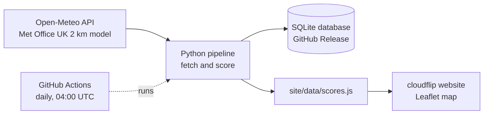
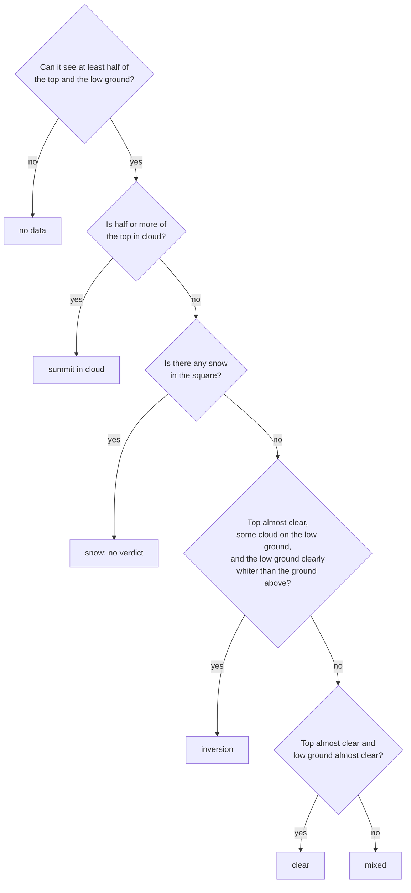

# cloudflip

**Will you stand above a sea of cloud at sunrise?** cloudflip forecasts the chance of a cloud inversion at each of Scotland's 282 Munros, for every morning of the coming week.

**Live site: [yourcloudflip.netlify.app](https://yourcloudflip.netlify.app)**

[](https://github.com/clbutler/cloud_inv/actions/workflows/nightly.yml)

[](https://yourcloudflip.netlify.app)

## What is a cloud inversion?

Normally the air gets colder with height. In a temperature inversion, a layer of warmer air sits above colder air. That warm "lid" traps cold, damp air in the glens, so cloud and fog fill the valleys while the summits stay clear. From the top of a Munro, the result is a sea of cloud below, often lit by the rising sun.

Scotland's 282 Munros, the mountains over 3,000 ft, are among the best places in the UK to see one. Inversions are hard to predict, though, and mountain forecasts are usually given per area, not per hill. cloudflip gives a verdict for every Munro, for every morning of the next seven days.

## How it works



1. **Fetch.** `scripts/openmeteo_function.py` asks [Open-Meteo](https://open-meteo.com) for 7 days of hourly Met Office forecasts at every Munro. It gets surface weather, plus temperature, humidity, cloud and wind at six pressure levels from about 100 m to 1,500 m. The pressure levels are what make an inversion visible: a warmer layer above a colder one.
2. **Score.** `scripts/inversion_score_function.py` checks every hour from one hour before sunrise to three hours after, and keeps the best hour for each Munro and day.
3. **Store.** Every run is saved to a SQLite database (see [The forecast database](#for-developers)).
4. **Publish.** `scripts/site_export_function.py` writes the latest scores for the website, a static page in `site/` that uses Leaflet.
5. **Automate.** A [GitHub Actions workflow](.github/workflows/nightly.yml) runs the whole pipeline every day at 04:00 UTC and commits the new website data. Netlify redeploys the site from `main` whenever that commit lands.

## How the forecast is scored

Each Munro is graded on four checks. Each check scores pass, partial or fail.

| Check | Question | Pass | Partial |
|---|---|---|---|
| **Warm lid** | Is there a layer below the summit where the air gets *warmer* with height? | temperature rises with height | cools slower than 3 °C/km |
| **Cloud below** | Is there enough moisture in the glens to form cloud or fog? | cloud ≥ 50 % or humidity ≥ 95 % | humidity ≥ 87 % |
| **Clear summit** | Will the summit itself be out of the cloud? | humidity < 84 % and little cloud above | humidity < 87 % |
| **Still air** | Is it calm enough below the summit for the cloud to settle? | wind ≤ 11 km/h | wind ≤ 20 km/h |

- **Likely**: all four checks pass.
- **Possible**: all four at least partly pass.
- **Unlikely**: anything else.

The thresholds come from the Mountain Weather Information Service (MWIS) articles on inversions, humidity thresholds for cloud from Wang & Rossow (1995, *J. Appl. Meteor.*), and radiation-fog rules from the fog-forecasting literature. Forecast models often misjudge the height of an inversion and local detail, so the score is a guide, not a guarantee.

## How accurate is it?

The forecast is checked against satellite pictures of the same mornings (see [How the satellite check works](#how-the-satellite-check-works)). Before trusting that, two other things need checking: that an inversion can be recognised from space at all, and that the automatic labeller recognises it.

### Can you tell an inversion from space?

Each satellite view was judged by eye. Where a [Geograph](https://www.geograph.org.uk) photo had been taken near the same Munro on the same day, the photo was judged separately, and the satellite view was always judged first so the photo couldn't sway it. Based on 68 pairs from 48 days:

| | |
|---|---|
| When the satellite view shows an inversion, the ground photo agrees | **88 %** |
| When the ground photo shows no inversion, the satellite view agrees | **91 %** |
| When the ground photo shows an inversion, the satellite view shows it too | **60 %** |

So an inversion seen from space is almost always real, but the satellite misses some that people photographed. Sentinel-2 passes at about 11:30 UTC, and Geograph records the day a photo was taken but not the time, so most of the misses are probably dawn inversions that had cleared by late morning.

### How good is the automatic labeller?

The labeller was checked two ways: against the satellite views judged by eye (557 views from 263 days), and straight against the ground photos (72 views), which doesn't depend on anyone's reading of the satellite view.

| | against views judged by eye | against ground photos |
|---|---|---|
| When it says "inversion", it's right | **57 %** | **93 %** |
| Of the real inversions, it finds | **67 %** | **35 %** |

The photo days are mostly clear-cut cases, so it's more often right there. It finds fewer of them because many had cleared before the satellite passed. Its rules were tuned on some months and tested on others held back for the purpose (March, June, September and December). On the held-back months it was right 58 % of the time and found 76 % of inversions, so the rules aren't just fitted to the data they were tuned on.

### Does the forecast work?

The site's scoring was run on [archived Met Office forecasts](https://open-meteo.com/en/docs/historical-forecast-api) for 40 Munros spread across Scotland, from August 2024 to June 2026. Each morning's verdict was then set against the labeller's reading of that day's satellite view: 7,814 Munro-mornings with a usable view, snowy views left out.

| Site's verdict | Inversion still visible at 11:30 |
|---|---|
| Likely | **16 %** |
| Possible | **7 %** |
| Unlikely | **1.3 %** |

A Likely morning is about 12 times as likely as an Unlikely one to show an inversion, and a Possible one about 5 times. The same pattern holds in the held-back months. But the forecast misses most inversions: only 15 % of the ones the satellite saw had been rated Likely or Possible.

These figures understate the forecast at sunrise. It scores dawn, and the satellite sees 11:30, by which time many inversions have lifted or cleared. Where the satellite showed the summit in cloud on a Possible morning, there was never an inversion, which suggests the clear-summit check is too lenient.

**Limits.** The 60 inversions checked by eye come from 32 separate days, many from a few settled spells, so the percentages are still rough. Sentinel-2 passes each place only every 2 to 5 days. The labeller can't judge snowy hills, because Sentinel-2's own classes mix up snow and cloud tops.

## How the satellite check works

[Sentinel-2](https://sentinel.esa.int/web/sentinel/missions/sentinel-2) photographs Britain every 2 to 5 days, at about 11:30 UTC, at 10 m resolution. From above, an inversion has a distinctive look: a flat sea of cloud filling the glens and stopping along the contours, with the high ground clear. Ordinary cloud doesn't care about height.


The labeller (`label_box` in `scripts/satellite_function.py`) turns that idea into rules. For each Munro and each satellite pass:

1. **Read a small square.** It reads an 8 km square centred on the summit, at 40 m per pixel, from [Microsoft Planetary Computer](https://planetarycomputer.microsoft.com). That's free, needs no key, and only downloads the square, not the whole picture.
2. **Classify every pixel.** Sentinel-2 comes with ESA's scene classification, which marks each pixel as cloud, snow, cloud shadow, vegetation, bare ground, water and so on. The labeller uses that, not the colours.
3. **Add the terrain.** The [Copernicus 30 m height model](https://planetarycomputer.microsoft.com/dataset/cop-dem-glo-30) gives the height of every pixel. That splits the square into:
   - **the top**: ground within 100 m of the summit's height and within 1 km of it;
   - **the low ground**: more than 300 m below the summit (the gold line in the pictures).
4. **Decide.** It works down these questions and stops at the first "yes":



The numbers behind those questions:

| Rule | Threshold | Why |
|---|---|---|
| Top almost clear | 10 % cloud or less | a few wisps on the summit are allowed |
| Some cloud on the low ground | 10 % or more | a cloud sea filling only the glen floors covers little of an 8 km square |
| Low ground clearly whiter than the ground above | at least 20 percentage points more white (cloud or snow class) | a cloud sea follows the contours; cumulus covers high and low ground alike, so this rule removes most false alarms |
| Any snow | more than 1 % of the square | a snowy summit is classed "not cloud", so it would pass as clear, and bright cloud is sometimes classed as snow |

**How the views were judged by eye.** `main_review_batch.py` builds a review page of satellite views. The page shows neither the labeller's verdict nor the forecast, and the cards are shuffled, so neither can sway the answer. Where a Geograph photo exists, it's revealed only after the satellite view has been answered. The batches so far are 67 random days since 2017 (`main_satellite_scan.py`) and 431 mornings the site had scored (`main_backcast.py`).

## For developers

### Running it locally

Requires Python 3.12.

```bash
python3.12 -m venv .venv
source .venv/bin/activate
pip install -r requirements.txt

cd scripts            # the scripts use paths relative to this folder
python main_munro.py  # about a minute; writes outputs/forecasts.db and site/data/scores.js
```

Then open `site/index.html` in a browser. No server or build step is needed.

<details>
<summary>The forecast database</summary>

The SQLite database (`forecasts.db`) isn't stored in the repo's files. It's attached to the GitHub Release [`data`](https://github.com/clbutler/cloud_inv/releases/tag/data). The nightly job downloads it, adds that night's run and uploads it again, keeping the previous copy as `forecasts-prev.db` in case the upload fails.

| Table | Contents | Kept |
|---|---|---|
| `forecasts` | hourly model output, one row per run, Munro and hour | 7 days |
| `scores` | each run's verdict, the four check grades and the values behind them | forever |
| `sunrise` | sunrise time per run, Munro and day | forever |
| `munros` | name, height, location and model ground height | replaced each run |

```bash
gh release download data --pattern forecasts.db --dir outputs
```
</details>

<details>
<summary>The satellite check scripts and data</summary>

```bash
cd scripts
python main_satellite_scan.py       # sample satellite passes over the Munros since 2017
python main_backcast.py forecast    # score past mornings from archived forecasts (about 2 hours: free API limits)
python main_backcast.py satellite   # label the satellite passes for the same Munros and days
python main_review_batch.py batch2  # build a review page, then open ../outputs/satellite_batch2/review.html
python main_validation.py           # rebuild the accuracy figures above
python main_sightings.py            # collect Geograph photos tagged as inversions
python main_satellite_sightings.py  # run the labeller on those photos' days
```

| File | What it holds |
|---|---|
| `data/satellite_batch1_checks.csv`, `data/satellite_batch2_checks.csv` | satellite views judged by eye (`visible`), with the ground photo verdict (`photo_shows`) where one was revealed |
| `data/satellite_image_checks.csv` | satellite views of days with a Geograph inversion photo, judged by eye |
| `data/inversion_sightings.csv` | Geograph photos tagged as inversions, each checked by hand (`inversion`) |

Everything under `outputs/` is rebuilt by the scripts and isn't kept in git.
</details>

## Credits and licences

Developed by Dr Chris Butler (project started January 2025).

- Forecast data: [Open-Meteo](https://open-meteo.com) (CC BY 4.0), using Met Office UKMO models. Open-Meteo's free tier is for non-commercial use.
- Munro list and locations: [The Database of British and Irish Hills](https://www.hills-database.co.uk/downloads.html) v8.0.1.
- Map: [Leaflet](https://leafletjs.com), with tiles © Esri.
- Scoring research: MWIS, Wang & Rossow (1995), and published radiation-fog forecasting rules.
- Satellite images: Copernicus Sentinel-2 data and the Copernicus DEM GLO-30 (© DLR e.V. 2010–2014 and © Airbus Defence and Space GmbH 2014–2018, provided under COPERNICUS by the European Union and ESA), accessed through Microsoft Planetary Computer.
- Sightings: photos on [Geograph Britain and Ireland](https://www.geograph.org.uk), © their photographers, licensed CC BY-SA 2.0. The repo stores only the date, place, title, photographer and link, not the photos.

**Safety:** cloudflip is an experimental forecast of scenery, not a safety tool. Before heading onto the hills, always check the [Mountain Weather Information Service](https://www.mwis.org.uk/forecasts/scottish), the [Met Office mountain forecast](https://www.metoffice.gov.uk/weather/specialist-forecasts/mountain) and, in winter, the [Scottish Avalanche Information Service](https://www.sais.gov.uk).
